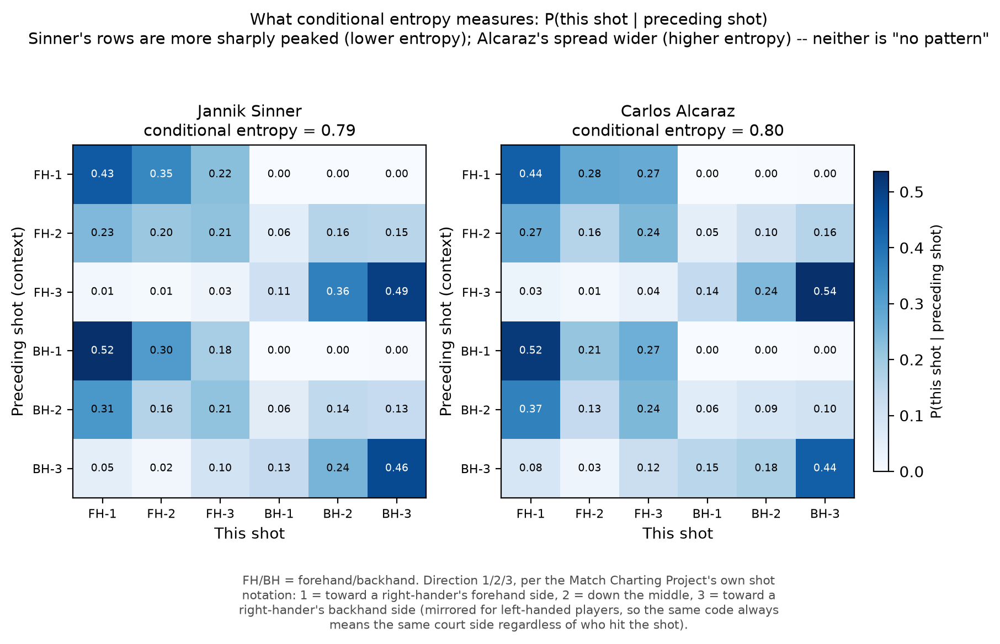

# Step 2: Entropy Pipeline Build & Sinner/Alcaraz Sanity Check

## Bug found and fixed: hitter attribution was inverted (Steps 1 & 2)

Every per-player shot attribution in this pipeline, and in Step 1's
`step1_validation.py` which has the same bug, was backwards until this fix.

The bug: hitter assignment worked by alternating parity through the parsed
shot tokens, assuming token index 0 was the serve (hit by the server).
That's wrong. The serve is coded as a direction digit (4/5/6), not a
shot-type letter, so `extract_shot_dir_pairs()` never captures it as a
token; the first token it returns is always the return of serve, hit by
the returner. Every subsequent shot's hitter label was therefore the
opposite of the truth, for every shot, in every point.

This wasn't just caught by re-reading the notation guide, it was verified
against real data two ways:
1. The guide's own worked example (`"6f27b1*"`) parses to `[('f','2'),
   ('b','1')]`; the guide explicitly says `'f27'` is the return (hit by the
   returner) and `'b1*'` is the server's winner. Token 0 is the return.
2. Empirically, for 17,490 real points ending in a marked winner shot
   (`'*'`), the winner's identity is known independently from the
   `PtWinner` column. The old idx-even-is-server assumption matched the
   actual point winner only 9.7% of the time. The fixed
   idx-even-is-returner logic matches 90.3% of the time, which is the
   signature of a clean, near-total inversion.

Fix: added a single shared `hitter_is_p1_for_token()` helper, replacing
three separately-duplicated, independently-buggy inline versions, and
corrected the `went_to_net` parity check in `get_pressure_features()`,
which had the same assumption baked in separately. This helper, and every
other piece of shared parsing/scoring logic, has since moved into a single
`src/core/parsing.py` module that both `step1_validation.py` and
`step2_entropy_pipeline.py` import from. The duplication above is exactly
why this refactor happened: the same bug existed independently in four
places because there was no single source of truth for this logic.

Impact on every number reported earlier in this project:
- Dropshot counts: a conclusion actually flipped. Previously "Sinner: 433,
  Alcaraz: 300," which looked like Sinner dropshots more. Corrected:
  Sinner 173, Alcaraz 503, so Alcaraz uses the dropshot roughly 3x more.
- Net-play rate: direction held, magnitude was badly understated. Sinner's
  normal-situation net rate was reported as 3.3%; corrected, it's 7.2%.
  Alcaraz went from 7.6% to 11.9%. Alcaraz is still more net-active, but
  the bug was silently missing roughly half of all real net approaches.
- Conditional (transition) entropy: the sanity-check direction held, exact
  values didn't. Sinner's conditional entropy moved from 0.8498 to 0.7921,
  Alcaraz's from 0.8691 to 0.8000; info gain moved from 12.9% to 18.4%
  (Sinner) and 10.7% to 16.8% (Alcaraz). Sinner is still lower-entropy and
  more context-dependent than Alcaraz, but that survival should be read as
  fortunate, not guaranteed: the dropshot finding above flipped outright
  under the same fix.
- Pooled (marginal) entropy: direction flipped, but this was already
  established as noise, since both players sit near the entropy ceiling
  either way. No change to the "pooled entropy isn't usable" conclusion.
- Serve zone and return-depth numbers are unchanged: those come directly
  from the `Svr` column, not from token parity, so they were never exposed
  to this bug. That's a useful internal consistency check that the fix was
  correctly scoped.

One action item follows from this: `step1_validation.py`'s per-player
sparsity check has the identical bug (same idx-parity assumption). It
doesn't affect Step 1's actual deliverable
(`qualified_player_pool_min40.csv`, built from match counts, not shot
attribution), but its printed sparsity diagnostics for
Sinner/Alcaraz/Draper/Nakashima were computed the same wrong way and
shouldn't be cited as-is if referenced later.

## Purpose in the pipeline
Build the Shannon entropy calculation that will serve as the style/predictor
variable in the eventual OLS regression (Stage 3), and validate it against the
Sinner vs. Alcaraz sanity-check pair established in Step 1.

## Files in this step
`step2_entropy_pipeline.py` is the pipeline script. It loads the Step 1
qualified player pool, re-fetches MCP data, reuses the Step 1 notation
parser, and implements two entropy calculations (see below). Running the
script end-to-end reproduces the full sanity check.

## Key decision made in this step: pooled entropy was not enough, moved to transition entropy

The pipeline was built to spec first: pooled Shannon entropy over the
6-cell {forehand, backhand} x {direction 1,2,3} grid, per Step 1's design
constraints (lob/other excluded, entropy restricted to the 6 core cells).
Sanity-checking it on Sinner vs. Alcaraz surfaced a problem, not a bug:

| | Pooled (marginal) normalized entropy |
|---|---|
| Sinner | 0.9712 |
| Alcaraz | 0.9697 |

These are the post-fix numbers (see the bug-fix section above); the
pre-fix numbers had Alcaraz slightly higher, 0.9809 vs 0.9767. The gap is
noise-level either way, which is the actual point of this section.

Both sit at ~97% of the theoretical max (log2(6) = 2.585 bits) and the gap
(0.0015) is noise. Pooling across an entire career averages away exactly
the kind of situational variation the paper's thesis is actually about.

The fix is transition (conditional) entropy. Instead of asking "what's the
distribution of this player's shots overall?", the pipeline now asks "how
predictable is this player's shot choice given the preceding shot in the
rally, i.e. the ball they're reacting to?" This is standard
information-theory practice (conditional entropy, a first-order Markov
view of the shot sequence) and it's a much closer match to what
"shot-selection consistency" should mean.

Result on the sanity-check pair (post-fix numbers, see the bug-fix section
above; pre-fix values were 0.8504/12.8% for Sinner and 0.8692/10.7% for
Alcaraz):

| | Marginal H | Conditional H\|context | Info gain from context |
|---|---|---|---|
| Sinner | 0.9702 | 0.7921 | 18.4% |
| Alcaraz | 0.9617 | 0.8000 | 16.8% |

Sinner's shot choice is both lower-entropy given context and more
context-dependent (a bigger drop from marginal to conditional) than
Alcaraz's. The direction of this finding survived the hitter-attribution
bug fix, but that should be read as a fortunate outcome, not a guarantee:
the dropshot count finding elsewhere in this document flipped outright
under the same fix. This is a meaningfully sharper and more substantively
interpretable signal than the pooled version, and it's the version that
should feed Stage 3.

### What conditional entropy actually looks like, cell by cell

Not for the abstract (that figure budget is spent elsewhere -- see
`paper/README.md`), but useful here, where there's no word or figure
limit: the table above reduces each player's whole shot-transition
structure to a single number, which can read as more abstract than it
is. The figure below shows the actual 6x6 P(this shot | preceding shot)
matrix each number is computed from.

Axis labels are FH/BH (forehand/backhand) x direction 1/2/3, per the
Match Charting Project's own shot notation: 1 = toward a right-hander's
forehand side, 2 = down the middle, 3 = toward a right-hander's backhand
side, mirrored for left-handed players so the same code always means the
same court side regardless of who hit the shot (definition per Tennis
Abstract's MCP Quick Start Guide; the figure itself repeats this in a
footnote so it's readable standalone).

Both players' rows are far from uniform -- neither shows "no pattern";
that reading would misstate what a *reliable, non-extreme* entropy value
(both sit at 0.79-0.80, nowhere near the 1.0 that true randomness would
imply) actually means. The visible difference is one of degree: Sinner's
rows are on average a little more sharply peaked (e.g. BH-1 -> FH-1 at
0.52 for both players, but Sinner's FH-1 row concentrates more of its
mass in the first three cells), consistent with the lower conditional
entropy and larger context-dependent information gain in the table
above. Built by
`src/figures/make_entropy_transition_illustration.py`, which reuses
`get_player_shot_transitions()` and `compute_transition_entropy()`
unchanged and asserts its recomputed conditional entropy for both
players against the 0.7921/0.8000 documented above before saving
anything.

## What "context" means here
For every shot a target player hits (that qualifies for the 6-cell grid: a
forehand or backhand with a valid direction digit), context = the (wing,
direction) of the immediately preceding shot in the same rally token
sequence, i.e. the shot they are responding to. Because token order
alternates hitter, this is always "the ball the target player just received,"
not their own previous shot. A catch-all `('other', 'x')` context bucket
absorbs cases where the preceding shot is a serve, lob, halfvolley, or missing
a direction digit, so those points aren't silently dropped.

## Data sufficiency
Both sanity-check players clear 30+ observations in every one of the 6
current-shot cells (pooled calc). Per-context sample sizes are smaller by
construction (each of the 6 context buckets splits the data further); the
pipeline flags any context bucket below 30 obs per player, though none were
flagged for Sinner or Alcaraz specifically; this flag will matter more once
the pipeline runs on thinner-coverage players near the 40-match floor.

## Data used
Only the 2020s points file (`charting-m-points-2020s.csv`) was loaded,
which fully covers both sanity-check players' careers. This isn't
sufficient for the full 91-player pool: most of it (Federer, Nadal,
Djokovic, Sampras, Agassi, etc.) has matches in the 2010s and pre-2010s
files. `load_points_data()` takes a `decades` argument for this; scaling
to the full pool needs `decades=('2020s', '2010s', 'to-2009')`.

## What's carried forward from Step 1 (unchanged)
- Player pool: `qualified_player_pool_min40.csv`, not raw MCP data.
- Shot categories: forehand/backhand only, 3 directions (6 cells), lob/other
  still excluded, same rationale as Step 1.
- Match/points data fetched fresh via `raw.githubusercontent.com` each session.

## Bug fix made while researching the extensions below
While pulling the official notation guide (from `MatchChart 0.3.2.xlsm`'s
`Instructions` tab, the actual charting spreadsheet, not a secondary
source) to scope the extensions, Step 1/2's `SHOT_TYPE_CHARS` set turned
out to be missing six valid shot-type letters: `m` (backhand lob), `i`
(backhand half-volley), `j`/`k` (forehand/backhand swinging volley), `t`
(trick shot), `q` (unknown shot type). In the 2020s points file alone
these occur ~28,700 times combined (`m` alone: 18,055). Because hitter
assignment works by alternating parity through the parsed token list, a
silently-skipped real token shifts every subsequent shot's hitter
assignment for the rest of that rally, a genuine correctness bug, not just
missing coverage. Fixed in `SHOT_TYPE_CHARS`; re-ran the Sinner/Alcaraz
sanity check afterward and the conditional-entropy numbers moved by
<0.001 (0.8504→0.8498 Sinner, 0.8691 Alcaraz unchanged to 4 decimals). The
conclusion was unaffected at this data volume, but this should be treated
as fixed going forward, not re-broken by copying the old character set
into new code.

## Extensions added: dropshot, serve zone at BP, net-play under pressure, return depth

Four additions beyond direction-only forehand/backhand entropy, each
checked against the official notation guide, not inferred, before
building. Numbers below are post-fix (see the bug-fix section at top); the
dropshot count actually flipped between players under the fix, so treat
any older copy of these numbers as void.

1. Dropshot as its own category. `u`/`y` were already being parsed but
   silently folded into the forehand/backhand wing buckets, erasing the
   signal. Split out in `EXTENDED_CATEGORY_MAP` / `get_player_shots_extended()`.
   Post-fix counts: Sinner 173, Alcaraz 503, so Alcaraz uses the dropshot
   roughly 3x more, the opposite of what the pre-fix numbers suggested.
   Sparsity check: both players' down-the-middle dropshot direction is
   sparse (Sinner 10 obs, Alcaraz 26 obs). Worth a per-player floor when
   scaling to the full pool, since dropshot volume runs ~100-500x smaller
   than the core forehand/backhand grid.

2. Serve zone across the full pressure ladder, via `parse_serve_prefix()`
   and the expanded taxonomy in `get_game_situation()`/`get_pressure_flags()`
   (not just break-point-vs-normal, see the score/situation section below).
   Wide-serve rate rises monotonically with pressure for both players
   (Sinner 40.6%→50.7% normal→match-point; Alcaraz 43.7%→57.1%), with
   Alcaraz's escalation notably sharper. Not affected by the
   hitter-attribution bug (serve zone comes from `Svr`, not token parity),
   so these numbers are unchanged from the pre-fix run.

3. Net-play / serve-and-volley rate, normal vs. high-pressure composite,
   via `get_pressure_features()`. Post-fix: Sinner went 7.2%→7.7%, Alcaraz
   11.9%→12.8% (normal→high-pressure). Alcaraz's net rate remains clearly
   higher than Sinner's at every level, but both rates roughly doubled from
   the pre-fix numbers (3.3%/7.6%): the bug was silently missing about half
   of all real net approaches by checking the wrong shot parity for "is
   this the server's own shot."

4. Return depth across the pressure ladder, via `parse_return_depth()`.
   One real data limitation: depth (7/8/9) is recorded only for the return
   of serve in MCP notation; there's no depth code for any other rally
   shot. "Length variability" as a general shot-length metric isn't
   available, so this is scoped to serve-return depth specifically. Not
   affected by the hitter-attribution bug (return depth is tied to role
   via `Svr`, not token parity), unchanged from the pre-fix run. Alcaraz
   shows a real shift toward shallower returns under pressure (26.0%→35.8%
   shallow, normal→match-point); Sinner's shift is smaller. Sample size is
   thin at match-point-as-returner (n=67-90), so treat that cell as
   suggestive, not solid, in this pair.

## Score/situation parsing (shared by extensions 2-4): expanded pressure taxonomy
No break-point flag exists in the raw points file (only in separate
match-level aggregate `-stats-` files), and no set-point/match-point flag
exists anywhere in MCP at all. The original version of this pipeline only
distinguished break_point vs normal, which undersells what "pressure"
means in a match, so this was expanded to a full ladder:

- Base game situation (`get_game_situation()`, mutually exclusive):
  `normal` / `approaching_break_point` (returner would create a break point
  by winning this point, e.g. 15-30 or 30-30, the "points to obtain the
  break point" case) / `deuce` / `game_point_server` / `break_point` /
  `tiebreak_or_other`.
- Set point / match point flags (`get_pressure_flags()`), layered on top of
  the base situation rather than replacing it, since a point can be a
  break point and a set point and a match point simultaneously. Requires
  match format: `sets_to_win` from `Best of` (3→2 sets, 5→3 sets) and the
  tiebreak target score from `Final TB?` (10 points for the 'A'/'S' codes,
  super-tiebreak formats, 7 otherwise). ~34 matches out of 7,567 have an
  unparseable `Best of` field (missing or garbage, e.g. one literal
  "Zindaras"); those are excluded from set/match point detection (flags
  all False) rather than guessed at, and none affect the Sinner/Alcaraz
  sanity pair.
- `is_high_pressure()`: composite flag, true if the base situation is
  tense (break/game/deuce/approaching-BP) or either set-point or
  match-point flag is set. This also catches tiebreak set/match points,
  which don't get a game-level category but are clearly high-pressure.
- Tiebreak points are handled with their own set/match-point logic
  (`parse_tiebreak_score()` + target-score comparison), since 'Pts' switches
  to a plain-integer format ('6-5') during a tiebreak rather than 0/15/30/40.
- `check_clinches_set()` uses a game-margin condition (>=6 games, >=2 game
  lead) with no hardcoded cap, so it correctly handles advantage-set
  matches that run past 6-6 (`Final TB?` in {'0','V'}) without
  special-casing.

Result on the sanity pair: the finer gradient shows something the simple
break-point/normal split couldn't. Wide-serve rate rises monotonically
with pressure for both players (Sinner 40.6%→50.7% normal→match-point;
Alcaraz 43.7%→57.1%), with Alcaraz escalating more sharply. Sample size
gets thin at the top of the ladder (match-point-as-returner: n=90 Sinner,
n=67 Alcaraz), so treat those specific cells as suggestive, not solid,
until the full pool is loaded and can be pooled or bucketed further if
needed.

## Data used for extensions
Same 2020s-only load as the base pipeline; same caveat applies: fine for the
sanity pair, needs the other two decade files before scaling to the full pool.

## Feeds into Step 3
Step 3 (leverage-weighted clutch score) needs a per-player entropy value to
eventually regress against. Use `conditional_normalized` (or
`conditional_entropy_bits`) from `compute_transition_entropy()` as the
primary style variable, not the pooled `normalized_entropy`: the sanity
check showed the pooled version doesn't carry a usable signal.
`info_gain_relative` is also worth keeping as a secondary style variable.

The four extensions add further candidate predictors/controls for Stage 3,
in rough order of how much signal the sanity check found:
- Serve-zone escalation across the pressure ladder (normal → approaching
  BP → BP → set point → match point) is the clearest gradient in the
  sanity check; Alcaraz's escalation is notably sharper than Sinner's.
  Worth building as a per-player slope/rate-of-escalation variable, not
  just a single before/after number.
- Net-play rate shift (normal → high-pressure composite) is a strong,
  consistent signal, likely worth including directly.
- Return-depth shift under pressure is real for Alcaraz, but the top of
  the pressure ladder (match-point-as-returner) has thin samples in this
  pair; revisit sample size once the full pool is loaded.
- Dropshot-direction entropy is usable in principle but needs a per-player
  minimum-observation floor before scaling; don't feed into regression
  un-floored.

Before scaling to the full 91-player pool: load the two additional decade
files, and set a floor on per-context sample size (parallel to Step 1's
40-match / 30-obs floor) so thin-coverage players near the pool's tail don't
get an unstable conditional entropy estimate, or an unstable dropshot/
pressure-situation estimate, from a handful of observations in a rare bucket.

A fifth extension was added later, closing an inconsistency: the three
extensions above are all normal-vs-high-pressure escalation deltas, but
`conditional_normalized_entropy` itself never was, until
`entropy_pressure_escalation.md` in this same folder tested whether a
player's shot-selection consistency changes under pressure. It doesn't,
in any way that predicts clutch performance: a fourth null result on top
of the primary one, and on a pool that turned out deep enough to support
the extra split without losing a single player.

