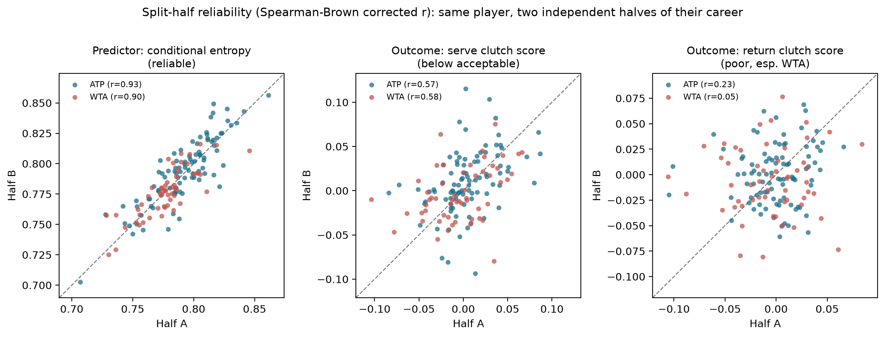
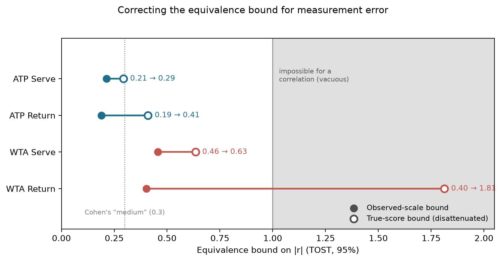

# Shot-Selection Consistency and Clutch Performance in Tennis: A Reliability Warning for Clutch Metrics

## Introduction

Tennis commentary often frames stylistic unpredictability as a pressure-performance asset: the "flair wins the big points" narrative applied to a player like Carlos Alcaraz, set against a metronomic player like Jannik Sinner. That claim has never been tested against a leverage-weighted outcome using an information-theoretic measure. We test whether shot-selection consistency predicts pressure performance and, separately, whether leverage-weighted clutch metrics (now widely used) can be measured reliably enough to support such claims.

## Methods

We measure shot-selection consistency as conditional Shannon entropy
(how predictable a player's shot choice is given the preceding shot),
computed from point-by-point Match Charting Project data. We measure
clutch performance as a leverage-weighted score after Morris (1977),
the same family as Tennis Abstract's Balanced Leverage
Ratio and the metric Stats Perform presented at SSAC 2022. Every
hypothesis was pre-registered before data was touched; the pipeline is
open and reproducible. The primary test drew on the qualified ATP
pool (91 players, 40+ charted matches each), five leverage-weighting
variants, and split-half reliability testing, alongside an
independently pre-registered WTA replication (55 players).

## Results

Split-half reliability testing found conditional entropy highly reliable
(0.90 to 0.93) on both tours, but leverage-weighted clutch scores only
moderately reliable on serve (0.57 to 0.58, below the 0.70 threshold)
and poor to unmeasurable on return (0.23 ATP, 0.055 WTA), despite bucket
sizes in the hundreds to thousands. Return clutch also depends on the opponent's serve
quality: a variance source that serve clutch, driven by the player's own
execution, doesn't share. A continuous-slope construction did not help; empirical-Bayes
shrinkage did, narrowing the gap (e.g. ATP return to 0.37) without
closing it.

**Figure 1.** Each point is one player's half-A vs. half-B value;
entropy clusters tightly, serve clutch loosely, return barely.

Given that asymmetry, conditional entropy still showed no relationship
with clutch performance: not on either tour, not on serve or return,
not across any of the five leverage variants, and not when both tours
were pooled (n = 146) and tested for a tour-by-entropy interaction.
Every comparison was Bonferroni-corrected. Equivalence testing bounds
the true ATP effect to under r = 0.21 on both roles; WTA's own bound is
far looser (up to 0.46). Correcting for both variables' reliability
leaves ATP intact but pushes the WTA return bound past 1, making it
uninformative given measurement error.

**Figure 2.** Equivalence bound on |r|, observed vs. reliability-corrected;
WTA return's bound exceeds 1 (uninformative).

## Conclusion

Leverage-weighted clutch metrics in industry use can have
reliability too low to support routine claims made about them
(particularly on return points), and no published clutch metric in
tennis appears to report its own reliability. Scouts and broadcasters
citing a player's return-clutch rating should first ask for its
split-half reliability, not just its headline number: the same
standard expected of a psychometric instrument. Separately, shot-selection predictability itself does not detect the
pressure-performance channel that scouting and broadcast narratives
assume, a corrective supported by two independent tours and a
robustness battery.
