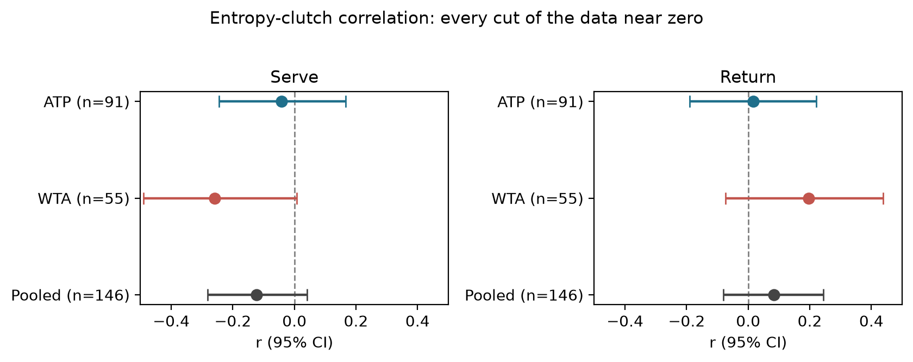

# Shot-Selection Consistency and Clutch Performance in Tennis: A Reliability Warning for Clutch Metrics and a Null Result

## Introduction

Tennis commentary often frames stylistic unpredictability as a pressure-performance asset: the "flair wins the big points" narrative applied to a player like Carlos Alcaraz, set against a metronomic player like Jannik Sinner. That claim has never been tested against a leverage-weighted outcome using an information-theoretic measure, despite growing industry reliance on leverage-weighted clutch metrics. We test whether shot-selection consistency predicts pressure performance and, separately, whether those clutch metrics can be measured reliably enough to support such claims.

## Methods

We measure shot-selection consistency as conditional Shannon entropy:
how predictable a player's shot choice is, given the preceding shot,
computed from point-by-point Match Charting Project data. We measure
clutch performance as a leverage-weighted score in the tradition of
Morris (1977), the same family as Tennis Abstract's Balanced Leverage
Ratio and the leverage metric Stats Perform presented at SSAC 2022. Every
hypothesis was pre-registered before data was touched; the pipeline is
open and reproducible. The primary test used the qualified ATP
pool (91 players, 40+ charted matches each), with an independently
pre-registered WTA replication (55 players), five leverage-weighting
variants, and split-half reliability testing.

## Results

Split-half reliability testing found conditional entropy highly reliable
(0.90 to 0.93) on both tours, but leverage-weighted clutch scores only
moderately reliable on serve (0.57 to 0.58, below the 0.70 threshold)
and poor to unmeasurable on return (0.23 ATP, 0.055 WTA), despite bucket
sizes in the hundreds to low thousands. Return clutch depends partly on the
opponent's serve quality, a variance source that serve clutch, driven by
the player's own execution, does not share. A
continuous-slope construction did not help; empirical-Bayes shrinkage
did, narrowing the gap (e.g. ATP return to 0.37) without closing it.

**Figure 1.** Each point is one player's half-A vs. half-B value
(Spearman-Brown-corrected r); entropy clusters tightly, serve clutch
loosely, return clutch barely.

Given that asymmetry, conditional entropy still showed no relationship
with leverage-weighted clutch performance, on either tour, on serve or
return, across all five leverage variants, or when pooled (n = 146) with
a formal interaction term, Bonferroni-corrected throughout. Equivalence
testing bounds the true effect to under r = 0.21 on both tours.
Correcting for both variables' reliability leaves ATP intact but pushes
the WTA return bound past 1, uninformative given measurement error.

**Figure 2.** Entropy-clutch r (95% CI), by tour and pooled; every
interval crosses zero.

## Conclusion

Leverage-weighted clutch metrics in industry use can have
reliability too low to support routine claims made about them,
particularly on return points, and no published clutch metric in tennis
currently reports its own reliability. Scouts and broadcasters citing a
player's return-clutch rating should first ask for its split-half
reliability, not just its headline number, the same standard expected
of a psychometric instrument. Separately, shot-selection predictability itself does not detect the
pressure-performance channel that scouting and broadcast narratives
commonly assume exists, a corrective supported by two independent tours
and a robustness battery.
